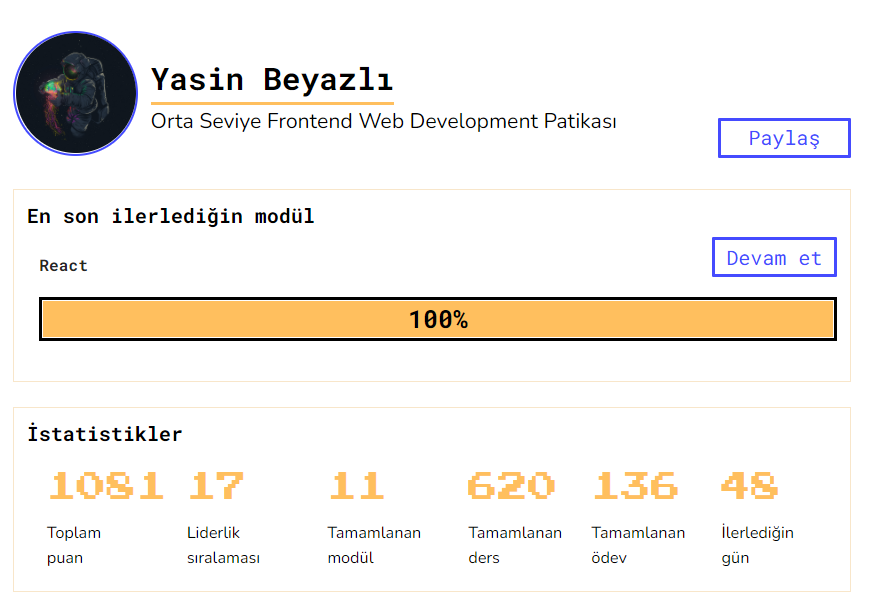

# bootcamp-hizlandirma

[Patka.dev](https://www.patika.dev/) bootcamp hızlandırma programına dahil oldugumdan beri patikada ilgilendiğim eğitimlerin ödevleri bu repoda yer almaktadır.

## HTML

- _İlk web sayfamızı oluşturmak_ için [tıklayınız](https://github.com/ysnbyzli/bootcamp-hizlandirma/tree/main/html/01)
- _Kişisel Sayfamızı Detaylandırmaya Devam Etmek_ için [tıklayınız](https://github.com/ysnbyzli/bootcamp-hizlandirma/tree/main/html/02)
- _Çikolatalı Küp Tarifi_ için [tıklayınız](https://github.com/ysnbyzli/bootcamp-hizlandirma/tree/main/html/04)

## CSS

- _Müzik Dükkanım_ için [tıklayınız](https://github.com/ysnbyzli/bootcamp-hizlandirma/tree/main/css/01)
- _Google Ana Sayfasını Tasarlamak_ için [tıklayınız](https://github.com/ysnbyzli/bootcamp-hizlandirma/tree/main/css/02)
- _Google Ana Sayfasını Tasarlamak 2_ için [tıklayınız](https://github.com/ysnbyzli/bootcamp-hizlandirma/tree/main/css/03)

## JAVASCRİPT

- _Saat ve Karşılama_ için [tıklayınız](https://codesandbox.io/s/patika-saat-karsilama-yyi48)
- _To Do List_ için [tıklayınız](https://github.com/ysnbyzli/bootcamp-hizlandirma/tree/main/js/02)
- _Asian Kitchen's Menu_ için [tıklayınız](https://github.com/ysnbyzli/bootcamp-hizlandirma/tree/main/js/03)

## REACT

- _Async Fonksiyonlar_ için [tıklayınız](https://github.com/ysnbyzli/bootcamp-hizlandirma/tree/main/react/01)
- _To Do List_ için [tıklayınız](https://github.com/ysnbyzli/bootcamp-hizlandirma/tree/main/react/02)
- _Hava Durumu_ için [tıklayınız](https://github.com/yasinbyzli/patika.dev-react-weather-app)
- _Emoji Search Testing_ için [tıklayınız](https://github.com/yasinbyzli/emoji-search/commit/7c7cd4d64f7530b1987de109a762066dd502e1c3)

- _Publishing_ için [tıklayınız](https://github.com/ysnbyzli/bootcamp-hizlandirma/tree/main/react/03)

## Redux

- _Note App_ için [tıklayınız](https://github.com/ysnbyzli/bootcamp-hizlandirma/tree/main/redux/note-app)
