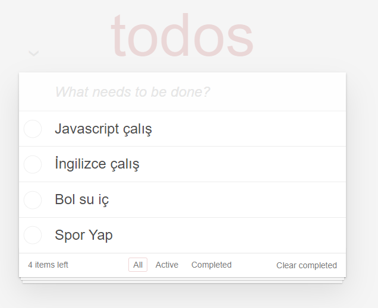
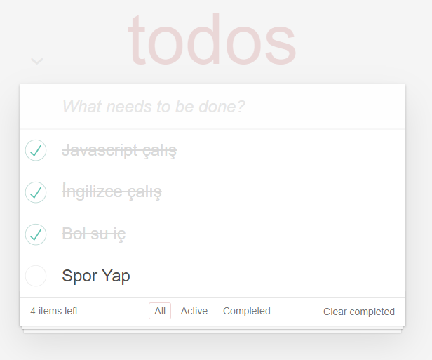
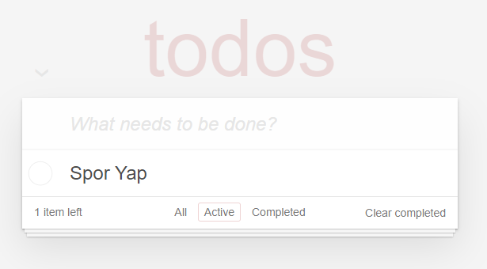
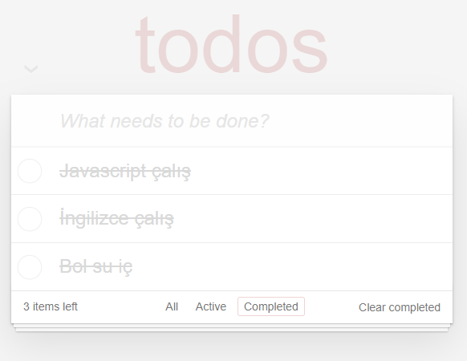

# Patika.dev - React Todo App

Bu proje [patika](https://app.patika.dev/) platformunda yer alan fronted patikası
react derslerindeki 2. ödev _Todo App_ uygulamasıdır.

## Paketler

- [uuid](https://www.npmjs.com/package/uuid)

## Özellikler

- Yeni bir task ekleme
- Task tamamlama
- Task silme
- Tüm taskları temizleme
- Task filtreleme

## Bilgisayarınızda Çalıştırın

Projeyi klonlayın

```bash
  git clone https://github.com/ysnbyzli/bootcamp-hizlandirma.git
```

Proje dizinine gidin

```bash
  cd react/02
```

Gerekli paketleri yükleyin

```bash
  npm install
```

Sunucuyu çalıştırın

```bash
  npm run start
```

## Ekran Görüntüleri

### Listeleme



### Tamamlama



### Aktif olanları gösterme



### Tamamlananları gösterme


