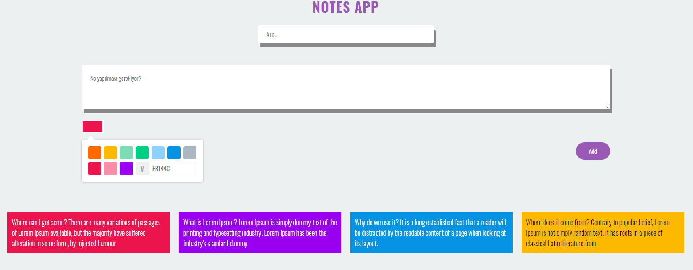
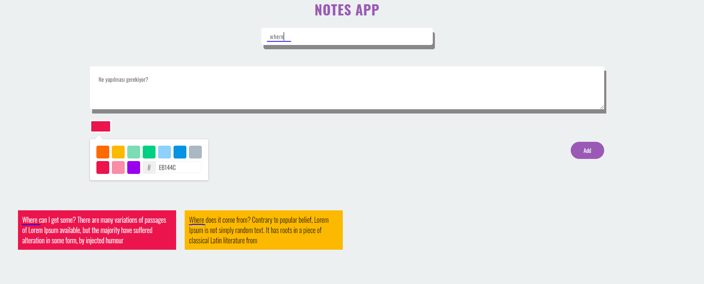
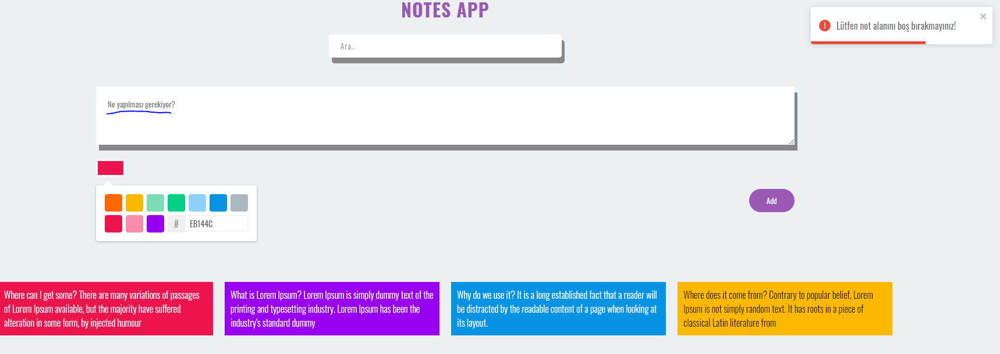

# Patika.dev - React-Redux Note App

## Paketler

- [@redux/toolkit](https://redux-toolkit.js.org/)
- [react-toastify](https://fkhadra.github.io/react-toastify/introduction/)
- [react-color](https://casesandberg.github.io/react-color/)

## Özellikler

- Yeni bir not ekleme
- Not arama
- Not rengini seçme
- Koyu/Açık arka plana göre yazı rengini değiştirme
- Uyarı mesajları

## Bilgisayarınızda Çalıştırın

Projeyi klonlayın

```bash
  git clone https://github.com/ysnbyzli/bootcamp-hizlandirma.git
```

Proje dizinine gidin

```bash
  cd redux & note-app
```

Gerekli paketleri yükleyin

```bash
  npm install
```

Sunucuyu çalıştırın

```bash
  npm run start
```

## Ekran Görüntüleri





